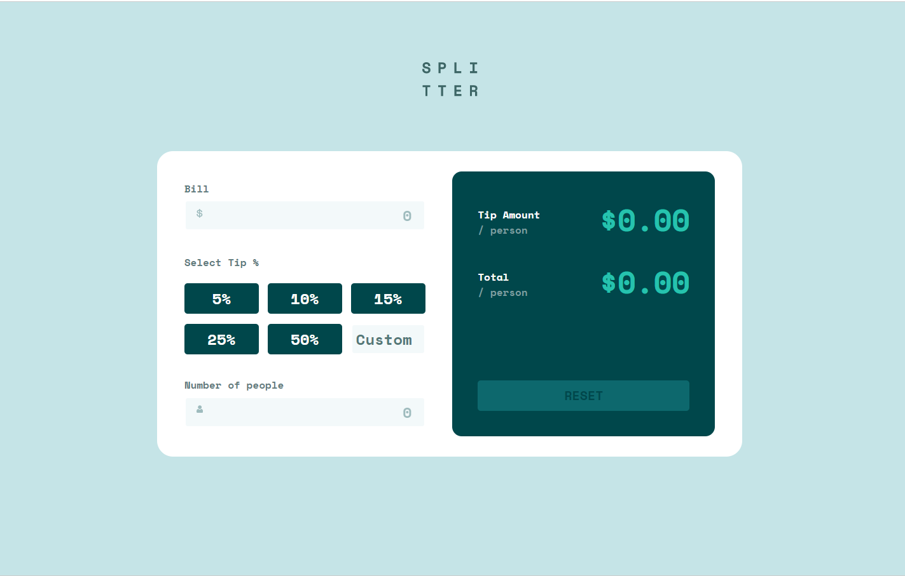

# Tip Calculator 
This is a JS web application that calculates the tip amount and total bill per person based on the bill amount, tip percentage, and number of people.

## Preview

## Technologies Used

- HTML
- CSS
- JavaScript

## Features

- Input validation for bill amount, custom tip percentage, and number of people
- Dynamic calculation of tip amount and total bill per person
- Reset button to clear all inputs and results

## Getting Started

You can access a live demo via [this link](https://kgogina.github.io/tip_calculator/). 
This allows you to use the application directly in your web browser without the need to clone or download the repository.

## Usage
1. Enter the bill amount in the "Bill" field.
2. Select a tip percentage from the available options or enter a custom tip percentage.
3. Enter the number of people sharing the bill.
4. The tip amount and total bill per person will be calculated and displayed automatically.
5. To reset all inputs and results, click the "Reset" button.

## JavaScript Functions

The JavaScript file `script.js` contains the following functions:

### calculateTip()

This function calculates the tip amount and total bill per person based on the bill amount, tip percentage, and number of people. It is called whenever the bill amount, tip percentage, or number of people input fields are changed.

### displayError()

The `displayError()` function is responsible for displaying error messages if any of the input fields have invalid or empty values. It is called by the `calculateTip()` function when necessary.

### reset()

The `reset()` function clears all the input fields and resets the tip amount and total bill per person to zero. It is called when the "Reset" button is clicked.

### Event Listeners

The JavaScript file also includes event listeners to detect changes in the input fields and button clicks:

- `billInput.addEventListener('input', calculateTip)`
- `tipInput.addEventListener('change', calculateTip)`
- `peopleInput.addEventListener('input', calculateTip)`
- `resetButton.addEventListener('click', reset)`

These event listeners trigger the respective functions when the corresponding events occur.

Please refer to the `script.js` file for more details and implementation of these functions.

## Contributing
Contributions are welcome! If you have any suggestions or improvements for the project, please create a pull request.

## Acknowledgements
Special thanks to [Frontend Mentor](https://www.frontendmentor.io) for providing the task/project that served as the basis for this code.

